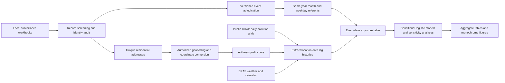

# Cardiovascular surveillance and short-term air pollution in Guangzhou

Analysis and scientific plotting code for a time-stratified case-crossover study of cardiovascular and cerebrovascular surveillance events in Guangzhou, China, during 2023–2025. This repository covers record preparation, event review, residential geocoding, daily environmental exposure matching, statistical models, sensitivity analyses, and black-and-white figures. It does **not** include manuscript generation, patient records, individual addresses, coordinates, identification numbers, geocoding responses, credentials, model-row datasets, or actual study results.

The scripts were exported from the study workflow on 5 October 2026. Python and R code has been syntax checked; the conditional-logistic engine has been checked against an independent likelihood using simulated observations. Reproducing the study estimates requires authorized local surveillance records and the original data-quality decisions. This is a research code release, not a one-click analysis of arbitrary surveillance exports.

## Workflow



## Data sources and versions

| Source | Role | Access and provenance |
|---|---|---|
| Guangzhou cardiovascular/cerebrovascular surveillance system | Recorded event date, diagnosis and ICD-10 code, age, sex, review status, current residential address, local person/report linkage | Restricted custodian data. No records are supplied. Use current residence, not household registration, for exposure matching. |
| [CHAP product catalogue](https://weijing-rs.github.io/product.html) | Public daily pollution estimates | Cite the original product papers and the exact versioned record used. |
| [ChinaHighPM2.5 record 21770406](https://zenodo.org/records/21770406) | Daily 1-km PM2.5, V4 | The downloader selects D1K archives for 2022–2025 and verifies provider MD5 checksums. Concentrations are in micrograms per cubic metre. |
| [ChinaHighPM10 record 21773535](https://zenodo.org/records/21773535) | Daily 1-km PM10, V4 | Same archive selection and checksum approach. |
| [ChinaHighO3 record 21811088](https://zenodo.org/records/21811088) | Daily 1-km maximum daily 8-hour average ozone, V3 | Use the product definition and units in this record; do not combine it with older ozone metrics. |
| [Open-Meteo Historical Weather API](https://open-meteo.com/en/docs/historical-weather-api) with `models=era5` | Daily mean 2-m temperature and relative humidity | Fixed regional lattice, nearest weather-grid assignment, Asia/Shanghai dates. These weather data are coarser than the pollution grids. |
| Official Chinese holiday notices | Statutory holidays, adjusted working days, full holiday-break sensitivity | Year-specific source links and definitions are stored in `build_calendar.py`. |
| AMap, Baidu, Tencent geocoding services | Candidate residential coordinates | External geocoding requires separate custodian authorization. Provider keys and responses stay local. API documentation: [AMap](https://lbs.amap.com/api/webservice/guide/api/georegeo), [Baidu](https://lbsyun.baidu.com/), [Tencent](https://lbs.qq.com/). |

The earlier CHAP landing records mentioned in the study planning were [PM2.5 6398971](https://zenodo.org/records/6398971), [PM10 6449937](https://zenodo.org/records/6449937), and [ozone 5765588](https://zenodo.org/records/5765588). The executable download script instead pins the version-specific records above. Record IDs, archive filenames, units, checksums, date coverage and retrieval dates must be retained locally. PM2.5 components are not analyzed by this release: daily coverage for the study years must first be verified using the [ChinaHighPMC record](https://zenodo.org/records/10011898).

Meteorology starts on 4 December 2022 so the 28-day temperature sensitivity has a complete history at the start of 2023. Public environment data are downloaded to ignored directories; they are not redistributed here. Downloading the national archives can require substantial disk space and time.

## Installation

Python 3.10+ (3.11+ recommended), R 4.2+, Node.js with npm, curl, and a libarchive build capable of reading the supplied archives are required. The geocoding orchestration uses POSIX file locks and therefore targets macOS/Linux. The R models and coordinate helper can be used separately on other systems.

Run all commands from the repository root:

```bash
python3 -m venv .venv
source .venv/bin/activate
pip install -r requirements.txt
Rscript install_R_dependencies.R
npm install
mkdir -p 原始数据 work/air_pollution_cc/private outputs/air_pollution_cc
chmod 700 work/air_pollution_cc/private
cp config/sources.example.json config/sources.local.json
```

Edit `config/sources.local.json` to supply each local workbook name and worksheet. Keep the local configuration ignored. The original directory name `原始数据` means “raw data”; it is retained for compatibility with the study scripts. For English source filenames, use `surveillance_2023.xlsx`, `surveillance_2024.xlsx`, and `surveillance_2025.xlsx` or your own names in the configuration.

Python dependencies are bounded compatibility ranges rather than a frozen environment. Save `pip freeze`, `R sessionInfo()`, Node version, and package versions with each local analysis. The coordinate helper pins gcoord 1.0.7; it performs an offline GCJ-02 to WGS84 transformation with a round-trip check.

## Surveillance-data preparation

See [the local data contract](docs/DATA_CONTRACT.md) for required fields and private intermediate files. The original workbook column names are retained as schema aliases. If your export uses different names, adapt the aliases before screening; do not silently infer missing event dates or replace them with report dates.

```bash
python work/air_pollution_cc/prepare_cases.py
python work/air_pollution_cc/analyze_cases.py
python work/air_pollution_cc/audit_identity.py
python work/air_pollution_cc/prepare_parallel_tasks.py
python work/air_pollution_cc/adjudicate_events.py
```

These steps create salted local person/location tokens, same-person event histories, candidate matches, temporal flags, outcome annotations and `event_adjudication.csv`. The salt is generated locally and must never be shared. Tokenized records remain sensitive because exact event dates, locations and clinical information can still permit linkage.

`event_adjudication.csv` records eligibility, decisions, review flags, deduplication status and the rule/version used. Review status, identity anomalies, same-day reports and short-interval events are audited. A flagged record is not automatically a confirmed duplicate or a recurrent acute event. Disease-specific monitoring definitions and clinical evidence determine the final classification. The anchored 28-day rule is a sensitivity scenario; it must not be presented as a universal surveillance definition. Do not interpret “first recorded event during surveillance” as lifetime first onset.

The broad cardiovascular group contains I20, I21, I22 and I46; the broad cerebrovascular group contains I60, I61, I63 and I64. Subtype analyses distinguish MI, angina, ischemic stroke, intracerebral hemorrhage and subarachnoid hemorrhage. I20 does not by itself establish unstable angina, and the broad groups overlap their constituent subtype analyses.

## Address to coordinates

1. Create a **local** queue of unique current residential addresses. Local location tokens connect the queue to events; identifiers, names and diagnoses are not sent to providers.
2. Obtain authorization from the data custodian for the selected geocoding provider and the exact address fields that would be transmitted. Confirm provider terms, retention, quotas and costs separately.
3. Place provider credentials in ignored local files under `work/air_pollution_cc/private/`: AMap `amap_key.json` uses `amap_web_key`; Baidu `baidu_key.json` uses `ak` and `sk`; Tencent `tencent_key.json` uses `key` and `sk`.
4. Only after approval, set `GEOCODING_AUTHORIZED=YES`. The exported external-geocoding entry points otherwise stop before requesting coordinates. Run `full_geocoding.py` for the AMap queue; `baidu_geocoding.py` and `tencent_geocoding.py` implement later-provider passes. The pilot script preserves its historical quota/sampling settings and is optional.
5. Store provider responses in local SQLite caches. Check district, road, building and number consistency, ambiguity, precision and candidate evidence. Convert GCJ-02 output to WGS84 with the offline helper. A CRS label must reflect an actual transformation, not a relabelled coordinate pair.
6. The historical multi-provider completion workflow uses `local_address_fallback.py` and `complete_fuzzy_coordinates.py` after the required local caches exist. Review their source and required cache filenames before running. Reference coordinates inferred from local address groups are explicitly marked as imputed; they are not verified individual residences.
7. Run `audit_address_coordinates.py`, followed by `build_location_quality.py`. Preserve original missingness, coordinate source, precision, uncertainty and verification flags.

Successful API geocoding, textual consistency, or a complete coordinate column does **not** establish accuracy within 1 km. Core, coarse and imputed addresses are kept distinct. Independently verified locations can qualify for a stricter main analysis; otherwise use the appropriate exploratory scope and address-restriction sensitivities. The released scripts do not certify positional accuracy.

## Coordinates to daily environmental exposure

```bash
python work/air_pollution_cc/download_chap.py --metadata-only
python work/air_pollution_cc/download_chap.py
python work/air_pollution_cc/verify_archives.py
python work/air_pollution_cc/crop_chap.py
python work/air_pollution_cc/download_weather.py
python work/air_pollution_cc/build_calendar.py
Rscript work/air_pollution_cc/prepare_weather_basis.R
python work/air_pollution_cc/prepare_two_group_study.py
python work/air_pollution_cc/extract_cardiovascular_exposure.py --all-events
python work/air_pollution_cc/verify_two_group_exposure.py
```

The crop rectangle is a buffered processing extent, not a Guangzhou boundary. Original netCDF coordinates, packing and missing-value behavior are preserved. Exposure extraction checks geographic coverage, selects the nearest available grid coordinate within the product extent, and retains cell/date lookup provenance. Weather-grid assignment uses spherical distance on the fixed regional lattice.

For **every event**, select all dates with the same weekday in the same calendar month and year. Use the **same residential location** for the case and every referent date. Construct daily lags before forming means, including dates outside the matched month. Use complete histories: lag 0–1 is the two-day mean; lag 0–2 and lag 0–3 are three- and four-day means. Do not substitute yearly or monthly CHAP products for these acute-exposure windows. A candidate date lacking required exposure or covariates causes removal of its entire fixed matched stratum; do not choose replacement referents according to pollution availability or levels.

See `extract_cardiovascular_exposure.py` for the actual location-to-cell lookup and event-date lag extraction. Individual exposure rows and coordinates stay in the ignored private directory.

## Statistical analysis

```bash
Rscript work/air_pollution_cc/analyze_two_group_registry.R
Rscript work/air_pollution_cc/run_two_group_registry_extensions.R
python work/air_pollution_cc/prepare_five_outcomes.py
Rscript work/air_pollution_cc/analyze_five_outcomes_registry.R
Rscript work/air_pollution_cc/run_five_outcomes_registry_extensions.R
Rscript work/air_pollution_cc/bootstrap_registry_months.R two_group
Rscript work/air_pollution_cc/bootstrap_registry_months.R five_outcomes
Rscript work/air_pollution_cc/subgroup_quality_diagnostics.R two_group
Rscript work/air_pollution_cc/subgroup_quality_diagnostics.R five_outcomes
Rscript work/air_pollution_cc/describe_two_group_weather.R
Rscript work/manuscript_reference/extend_reference_methods.R
```

The main engine fits conditional logistic regression stratified by event, using person-clustered robust standard errors. With one case per stratum, exact and Efron coefficient estimates are checked against an independently calculated conditional likelihood. Pollutant effects are ORs per **10 micrograms per cubic metre**, using lag 0–1 as the reference window. Temperature uses a nonlinear distributed-lag cross-basis over lags 0–21; humidity uses a natural spline for its lag 0–3 mean. Statutory holidays and adjusted working days are included. Age and sex main effects are controlled by self-matching; pollutant interactions estimate modification.

Implemented analyses include single-day and moving-average windows, lag 0–7 distributed-lag effects, nonlinear exposure–response curves, PM2.5+ozone and PM10+ozone models, age/sex/season interactions, seasonal follow-up, temperature lags 14/28 and alternative degrees of freedom, first-record restrictions, event/identity/address quality restrictions, explicit 28-day scenarios, flagged-date exclusion, common complete samples, official-break calendar sensitivity and exposure-tail restrictions. Whole-month resampling retains complete strata to investigate shared temporal dependence; person clustering alone does not resolve correlation among different cases on the same date. The bootstrap seed and number of replicates are recorded in source and local outputs.

The five-subtype reference family applies Benjamini–Hochberg correction across 15 pollutant–outcome tests. The historical two-group scripts use three tests within each broad disease group. Seasonal tests are corrected across 21 overlapping broad/subtype comparisons. These are different testing families and should be reported explicitly. Seasonal follow-up and added windows are exploratory; do not select the principal window by its P value. Distributed-lag cumulative effects are not moving-average effects.

The historical registry analysis deliberately retains flagged or unresolved events and lower-quality coordinates, alongside restrictions. It does not override strict event adjudication or imply that all reports are verified acute events. Source-specific quality decisions require review before using these scripts in another surveillance system.

## Scientific figures only

```bash
python work/air_pollution_cc/describe_candidates.py
python work/prepare_plot_inputs.py
Rscript work/manuscript_season/analyze_season.R
Rscript work/manuscript_review/plot_black_white.R
Rscript work/manuscript_season/combine_figures.R
Rscript work/figure2_revision/smooth.R
```

The plotting scripts create monochrome PNG and vector PDF files for flow/forest plots, lag curves, exposure–response curves, seasonal and co-pollutant comparisons, quality restrictions, annual counts and supplementary plots. `smooth.R` evaluates the **same fitted natural lag spline** on a denser grid; it checks reconstruction against the integer-lag estimates and confidence intervals, rather than fitting a new smoothing model. Its Figure 2 replaces the angular eight-point rendering in the combined-figure output. Plot filenames retain historical analysis labels; publication numbering should be assigned for the intended presentation.

Only locally generated aggregate inputs are used for figures. The historical directory names containing `manuscript` are retained because analysis and plotting scripts refer to them; no manuscript-building script is included.

## Validation and privacy

```bash
python tools/check_release.py
Rscript tests/validate_models.R
```

The release check parses Python, verifies permitted file types, and scans for common credential formats, direct identity literals, user-specific home paths and banned artifacts. The R test uses newly simulated observations, checks an independent conditional likelihood and exact-vs-Efron estimates, and verifies whole-stratum removal when one candidate is missing. No actual surveillance input is used by these tests. See [privacy rules](docs/PRIVACY.md) and [reproducibility notes](docs/REPRODUCIBILITY.md).

A deny-by-default `.gitignore` permits source and documentation while excluding workbooks, CSVs, coordinates, salts, credentials, SQLite caches, RDS files, downloaded grids and generated outputs. This protects ordinary staging, but is not a substitute for a release review. **Do not use `git add -f` for data directories.** Do not publish even pseudonymized event rows or provider caches. Review aggregate cell sizes before any separate results release.

## Citation and reuse

Please cite the original CHAP product publications and the exact data records, ERA5/Open-Meteo, the surveillance-data custodian under its required wording, and any geocoding provider used. The download records provide the product-specific citation requirements. No patient-data access rights are granted by this repository. Third-party datasets and software retain their own terms; no additional software reuse license is assigned in this initial release.
